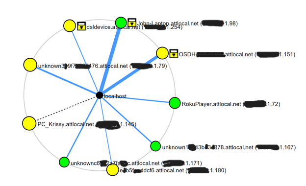

# Excerpt from NMap Assignment

In my audit, I found a total of 16 devices connected to my home WiFi network. Even when some of these devices were turned off, they could still be discovered because it checked each port in the network range. Some devices, such as my work laptop and e-reader, did not appear on the initial scan list as these devices were turned off. I used the following command: `Nmap -sL 555.444.1.0/24`, which returned a list of all devices currently listening in on the network. Then I double-checked my results against my home router’s private IP address, which listed all known devices on the network.

This topology map is simple in that it shows how many hops each host is from the center, which is equal to one. Each host is represented by a circle, while a router is represented by a square. Colored circles denote how many open ports there are on the host. The larger the circle, the more open ports exist. Green circles indicate the host has fewer than three open ports. Yellow circles indicate the host has between three and six open ports. If there are more open ports than six, the circle is red. Additionally, the yellow lock symbol indicates that the host has some ports that are being filtered.
