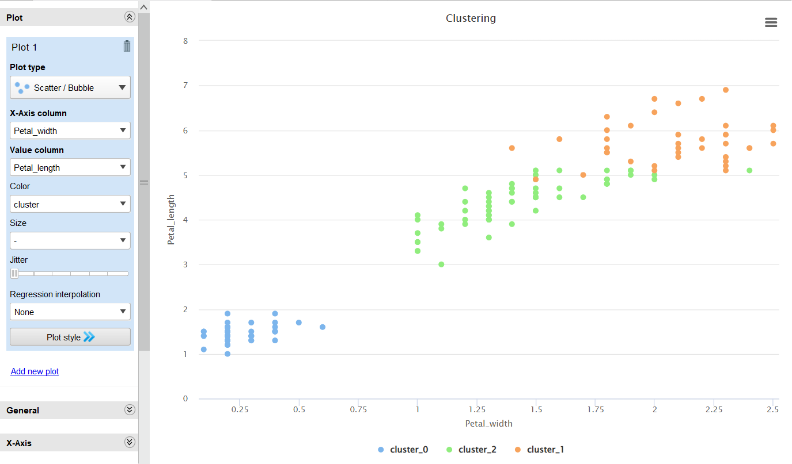
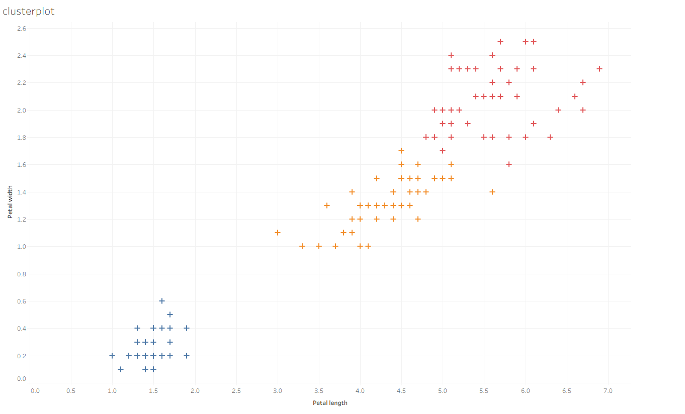
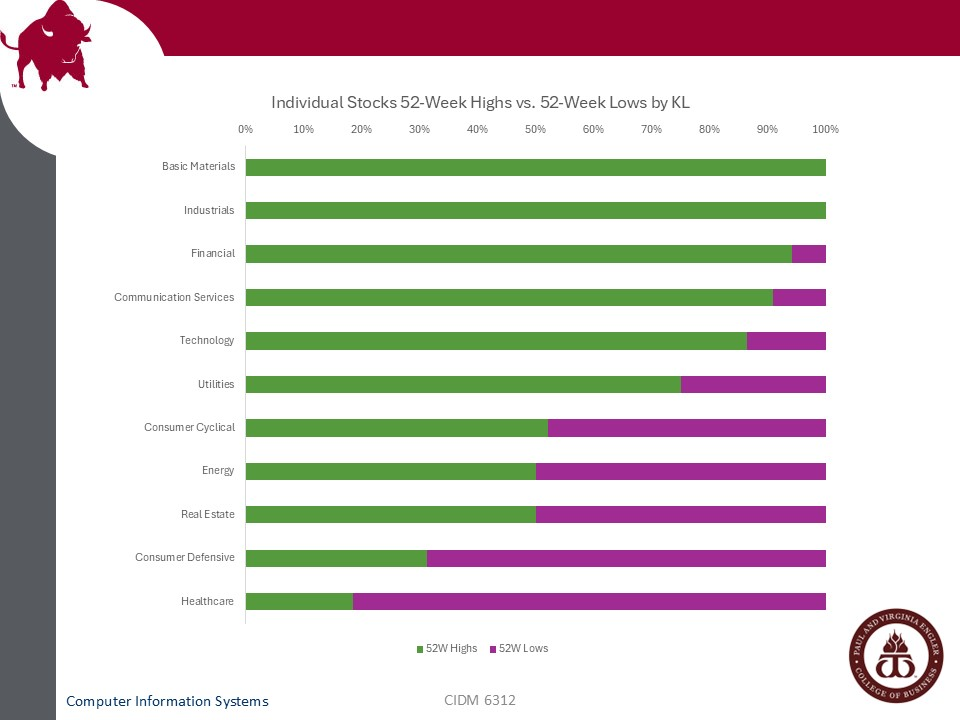

# Data Analytics
## Introduction
I completed the *Seminar in Data Analytics* and *Seminar in Information Visualization* courses for the data analytics curriculum area. These two courses were arguably the strongest and most valuable courses in the CISBA program. 

I learned to confidently prepare data for data visualizations using Rapidminer AI Studio; describe theoretical data visualization concepts to non-technical peers; and produce data visualizations using Excel, Tableau, and Python. [Datacamp](https://www.datacamp.com/) was a great knowledge source for much of this work, as were the courses’ textbooks, *Data Science for Business: What You Need to Know About Data Mining and Data-Analytic Thinking* (Provost & Fawcett) and *Data Visualization: Exploring and Explaining with Data* (Camm, Cochran, Fry, Ohlmann) respectively. 

Due to the shortened course length, I felt there was not enough time for me to master the following topics: explaining how data analytics is applied and sustained in business; practice with classification, regression, and clustering techniques; data retrieval from non-packaged sources; and using the seaborn Python package. However, I feel that these are minor knowledge gaps compared to other curriculum areas (e.g., networking and cybersecurity).

Since I engage with this domain frequently in my professional career, I immediately applied the skills and concepts from these classes. I even convinced my department to select Tableau as our primary data visualization tool which gave me extra practice with the above concepts. I was also able to explain why certain charts (i.e., pie graphs and gauges) were confusing for leadership and our own team to follow. In the future, if allowed, I will expand my usage of Tableau dashboards by integrating Rapidminer AI Studio to build a live ETL from regular data dumps.

## Integration
Data analytics naturally integrates with data management, software systems, and networking/cybersecurity because it is dependent on all three domains to function appropriately before analytics is possible. Concerning data management, the data must be present before it can be analyzed. Additionally, data can only be managed if it has been properly networked and protected with standardized protocols. Arguably, software is an optional component of data analysis since, for some cases, analysis can be done with traditional pen-and-paper methods. This is especially true for small data sets and a deep knowledge of mathematics (e.g., algebra, calculus, statistics, forecasting, paper graphing, etc.). However, since software is ubiquitous in most modern organizations, software is the common tool to perform data analysis. Furthermore, combining two or more software (e.g., connecting an Excel workbook to a Tableau dashboard and updating the Excel file to see changes in the dashboard) represents a minimum requirement to call this a software “system”.

Consider the following use-case for a prototype representative project. My department wants to survey senior leadership regarding their top priorities for internal quality improvement projects in the next fiscal year. Our objective is to consolidate, summarize, and make recommendations to executive leadership on behalf of the senior leaders. To do this, the survey tool must have privacy controls (cybersecurity) to prevent external actors from accessing the survey. Survey results must be stored in a table (software systems). Next, acting as the analyst, I need to extract those results and transform it into usable, valuable data (data management and data analytics). Finally, I need to develop a presentation to executive leadership by acting on those insights (data analytics).

## Work Samples
The following work samples highlight some of the key skills gained during these courses.

  
This assignment in *Seminar in Data Analytics* used Rapidminer AI Studio to extract, transform, and load raw data; and produce data visualizations. It also focused on descriptive modeling using classification and regression techniques to estimate which instances were most likely to belong to the one of three different species in the *Iris* genus: *setsosa*, *versicolour*, or *virginica*. 

  
This exercise was recreated using Tableau, which produced a similar chart but went through a different process. One of the goals of this assignment was to evaluate which tool was better for conducting classification and regression techniques. Overall, I felt that Rapidminer was easier to work with since many of the operations were predefined and, if not, a custom operation could be used. However, Tableau produced a better data visual and had more options to customize the look and feel of the chart. In practice, I would use Rapidminer to conduct ETL and connect the results to Tableau to customize the chart.

  
This assignment taught data visualization principles by evaluating and recreating charts in Microsoft Excel. In this graph, I practiced the following skills: reducing visual clutter (increasing the data-ink ratio) by eliminating gridlines; choosing appropriate chart-types (by choosing a categorical bar chart, this allows the viewer to easily read the categories); and minimizing color choices by only choosing two colors and ordering in descending order. This chart recreated a cluttered and confusing dynamic ribbon chart from [this website]( https://public.flourish.studio/visualisation/21013722/?utm_source=trendswithnofriends.stocktwits.com&utm_medium=referral&utm_campaign=phibro-animal-health-pops-10). Notably, since many of my professional colleagues do not know how to use dynamic Tableau charts, it was important to be able to convert dynamic charts into static ones.

## Conclusion
As evidenced by this discussion, I feel I’ve built a strong foundation in data analytics. These courses not only enhanced my technical skills but also gave me practical communication strategies to explain data-driven insights to non-technical stakeholders. Most importantly, I left with the confidence and motivation to continue refining my expertise through on-the-job application and ongoing professional learning.

Some topics I plan to explore more in-depth are clustering and regression techniques, appropriate forecasting methods, stack design, Microsoft PowerBI (and other data visualization tools such as Looker Studio), and integrating Python scripts into data visualization tools. I also look forward to developing my communication skills with non-technical stakeholders for these advanced topics.
