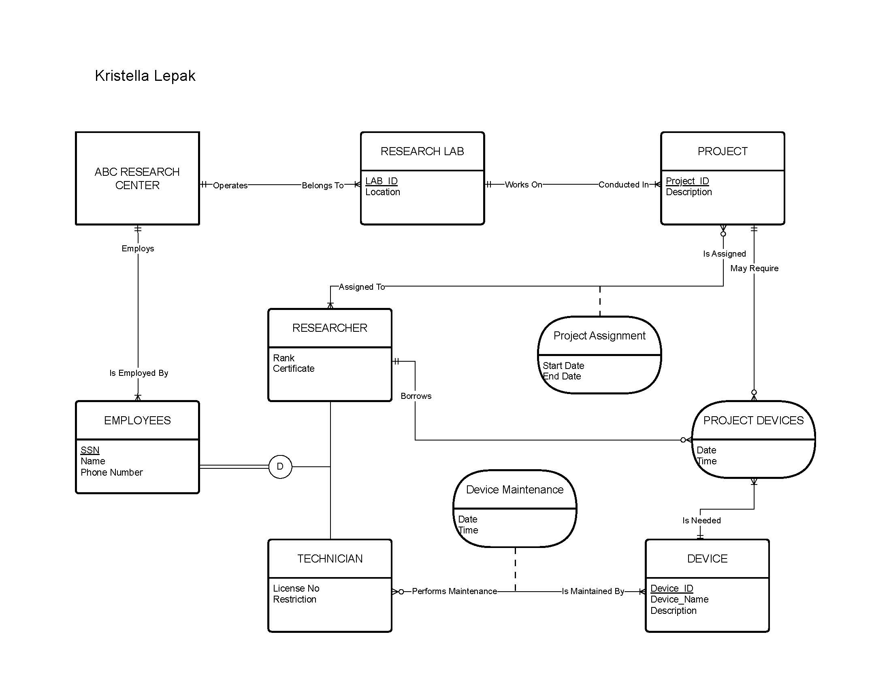

# Data Management
## Introduction
I completed the *Data and Information Management* and *Business Data Extraction, Transformation, and Load * courses for the data management curriculum area. These two courses were so valuable to me that I considered ranking them above my data analytics courses. 

I learned to produce entity relationship (ER), enhanced entity relationship (EER), and relational schemas for database architectures using Draw.io; collect requirements to produce those diagrams; explain basic concepts and procedures of business data ETL, data warehouses, data lakes, data marts, and data pipelines; and engineer a lightweight ETL using web scraping packages for Python in Google Colab. The two greatest knowledge sources for these courses, respectively, were the course textbook,  *Modern Database Management, 12th Ed* (Hoffer, Ramesh, & Topi) and [Datacamp](https://www.datacamp.com/), which taught all of the data engineering and python skills. 

Due to the shortened course length, I felt there was not enough time for me to master the following topics: explaining the history of database models, current trends, and current applications in business; DDL; DML; Airflow; and database querying using cube and rollup techniques. However, these are minor knowledge gaps compared to other curriculum areas (e.g., networking and cybersecurity).

Although I have no prior experience working directly with database schemas and ETL engineering, I work in the public health field and am constantly exposed to “systems design” and “systems thinking”, which is really just a fancy way of saying “other things outside this building affects our work”. Pretty obvious for literally any domain! Although public health tends to lean on R (statistical language) and SPSS (statistical software), some SQL and Python knowledge is applied in specific applications. Importantly, I work at a state public health agency that does not currently have a centralized database and is actively working on implementing one. This project is expected to take at least five years and is currently in year three with the primary goal of completing a data governance policy. These technology modernization projects require expertise or at least knowledge in the aforementioned topics. In my work, I plan to communicate technical aspects of legacy migration and modernization projects to non-technical stakeholders and key decision makers. If allowed, I would also like to be part of setting best practices for ETL engineering.

## Integration
Data management (assuming digital files) naturally integrates with software systems and networking/cybersecurity because these are prerequisites for functionality. Although data analytics is not required to perform data management, it is the next step in a value-delivery model. Just like a file cabinet or cardboard box is required to store physical files, software systems are required to store digital files (data management). Likewise, just as a locked file cabinet or front door is required to protect information in physical files, networking and cybersecurity are required to protect digital files. After data has been managed, the opportunity for data analytics becomes relevant. Following our metaphor, we can sort physical files by first name, last name, or provider. However, with digital data management, we can now perform all kinds of analysis like which provider has the most patients or cross-referencing patients who live near a Superfund site and patients with similar cancer diagnoses. 

Continuing the prototype representative project from [Assignment1](link); recall that the primary objective is to survey senior leaders; summarize their top priorities for the next year; and deliver a presentation to executive leadership. Data management tasks involve especially setting up the responses table and engineering an ETL to support the dashboard. Since the survey tool is intended to only query relevant information, I can enrich the dataset by pulling in other tables such as employee information (department, supervisor, etc.) and related projects. Furthermore, I can create a database schema using primary and secondary keys to de-identify the participants and reduce bias from the analysis.

## Work Samples
The following work samples highlight some of the key skills gained during these courses.

  
This EER diagram was developed to explain the relationships between different primary entities (research lab, project, device, researcher, ABC research center, technician, employees) and associative entities (project assignment, device maintenance). Note the underlined names in each primary entity which denotes the primary key. Associative entities do not have a unique key but are either identified by the combination of primary keys from their respective primary entities or have an assigned key (e.g., ticket number).

```python
# Extract data from the raw_data.csv file
def extract(file_name):
  return pd.read_csv(file_name)
  # Write cleaned_data to a CSV using file_name
  data_frame.to_csv(file_name)
  print(f"Successfully loaded data to {file_name}")

extracted_data = extract(file_name="raw_data.csv")

# Transform the extracted_data
def transform(data_frame):
  return data_frame.loc[:, ["industry_name", "number_of_firms"]]
try:
    clean_sales_data = transform(extracted_data)
    logging.info("Successfully filtered DataFrame by 'Total Price'")
except KeyError as ke:
    logging.warning(f"{ke}: Cannot filter DataFrame by 'Total Price'")

transformed_data = transform(data_frame=extracted_data)

# Load the transformed_data to cleaned_data.csv
def load(data_frame, file_name):
  data_frame.to_csv(file_name)

cleaned_data = load(data_frame=transformed_data, target_table="cleaned_data")
```  
This code example consolidates the essentials for an ETL pipeline in Python using pandas and logging packages. In this sequence, I extract data from a .csv file by first defining a `load` function with the pandas function `to_csv` and then using it to extract the raw data into a pandas dataframe. Then, I transform the dataframe by first defining the `transform` function. This creates a new dataframe by iterating over the old one and only returning the industry_name and number_of_firms columns. This also employs a logging function which attempts to flag errors during this process should the instance (row) not fulfil certain criteria. Lastly, it loads the transformed data into a new csv file through the `load` function.

```python
# Import process from thefuzz
from thefuzz import process

# Store the unique values of cuisine_type in unique_types
unique_types = restaurants['cuisine_type'].unique()

# Calculate similarity of 'asian' to all values of unique_types
print(process.extract('asian', unique_types, limit = len(unique_types)))

# Calculate similarity of 'american' to all values of unique_types
print(process.extract('american', unique_types, limit = len(unique_types)))

# Calculate similarity of 'italian' to all values of unique_types
print(process.extract('italian', unique_types, limit = len(unique_types)))

# Create a list of matches, comparing 'italian' with the cuisine_type column
matches = process.extract('italian', restaurants['cuisine_type'], limit = len(restaurants.cuisine_type))

# Inspect the first 5 matches
print(matches[0:5])

# Iterate through the list of matches to italian
for match in matches:
  # Check whether the similarity score is greater than or equal to 80
  if match[1] >= 80:
    # Select all rows where the cuisine_type is spelled this way, and set them to the correct cuisine
    restaurants.loc[restaurants['cuisine_type']==match[0], 'cuisine_type'] = 'italian'

# Isolate potential matches with row sum >=3
matches = potential_matches[potential_matches.sum(axis=1) >= 3]

# Get values of second column index of matches
matching_indices = matches.index.get_level_values(1)

# Subset restaurants_new based on non-duplicate values
non_dup = restaurants_new[~restaurants_new.index.isin(matching_indices)]

# Append non_dup to restaurants
full_restaurants = restaurants.append(non_dup)
print(full_restaurants)


```  
This code example demonstrates how information from a web scraper can be transformed into an array by leveraging TheFuzz Python package; specifically used for string matching. In this example, web scraped data has already been placed into an array `restaurants`. This starts by initializing a variable, `unique_types`, and iterating over the `cuisine_type` array to see how many restaurants may be similar to Asian, American, and Italian restaurants. Then, it checks to see if the similarity score is above 80, which indicates a strong match. Finally, it appends the results to the original `restaurants` array and prints the results.

## Conclusion
As evidenced by this discussion, I feel I’ve built a strong foundation in data management. These courses not only enhanced my technical skills but also gave me practical communication strategies to discuss basic data storage processes, ETL pipelines, and how to collect requirements to build an EER. Most importantly, I left with the confidence and motivation to continue refining my expertise through on-the-job application and ongoing professional learning.

Some topics I plan to explore more in-depth are ETL engineering using cloud-technology and scheduled jobs, and more practice with different querying techniques. I also look forward to developing my communication skills with non-technical stakeholders for these advanced topics.