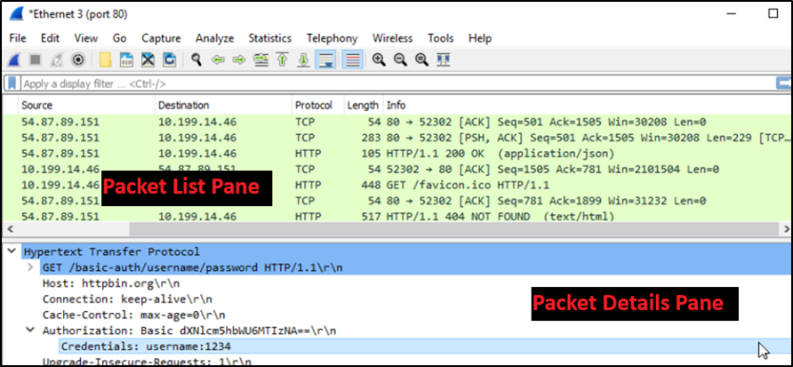

# Networking/Cybersecurity
## Introduction
I completed *Networking Management and Information Security* and am currently enrolled in *Cyber Risk Management* for the Networking/Cybersecurity curriculum area. These two courses introduced and exposed me to new topics, skills, and applications: despite having a very similar curriculum. 

I learned to conduct a home network assessment using Nmap and Wireshark; explain where cybersecurity threats may be present in an organizational and personal setting; apply basic computer security controls using national standards; and describe basic computer networking components. I derived much of my knowledge from reading technical security standards and protocols from the [National Institute of Standards and Technology (NIST)]( https://www.nist.gov/publications) and the [Center for Internet Security (CIS)]( https://www.cisecurity.org/). I also learned a lot from [TechRadar Pro]( https://www.techradar.com/pro), a UK-based news publication regulated by the Independent Press Standards Organisation (IPSO), and [IBM Think]( https://www.ibm.com/think), a blog run by IBM with digestible-but-accurate non-biased knowledge articles that define basic networking and cybersecurity topics. Although the courses did include one textbook, *An Introduction to Computer Networks* (Peter Dordal) and PowerPoint slides to *Management of Information Security, 6th ed.* (Whitman & Mattord), they were rarely useful (if at all) to the actual assignments.

Due to an intense focus on knowledge requirements for the assignments, I felt a deep lack of foundational knowledge of networking and computer security in the following topics: network components and common network architecture patterns, business requirements for risk management, and describing/applying enterprise-level cybersecurity practices. Understandably, some of these topics are difficult to teach outside of enterprise environments. However, due to the lack of foundational knowledge in network components and architecture patterns, I feel deeply unprepared to deploy specific cybersecurity protocols and applications taught in these courses. I will likely take additional courses outside of this degree to enhance my knowledge in these areas.

Much of the basic computer security practices discussed in these courses are repetitions of what I encounter in my professional world including: assessing and ensuring password strength (15+ characters using letters, numbers, and special characters), avoiding phishing scams, not using random USB sticks you find in the parking lot, regularly updating hardware devices for security patches, being aware of sensitive data you may be responsible for, etc. However, in my readings of NIST and CIA standards, I discovered other protocols such as conducting risk assessments and how to assign priority levels, conducting network assessments to discover connected devices (known and unknown), and which applications are useful for intrusion detection (which is a very specific part of cybersecurity that these courses heavily featured). In the future work, I will likely consult with computer security experts instead of conducting these assessments myself. This will increase the cost of doing the work to my organization, but it is money well-spent.

## Integration
Networking/Cybersecurity integrates with data analytics, software systems, and data management because it is a core component of all listed topics. Networking is especially important because it is the method for how computers talk to each other and sometimes to itself. Technically, cybersecurity is only relevant when computers are connected to the internet. But since closed or private networks in enterprise settings are rare, cybersecurity is a natural part of the foundation for executing any task with a computer. Considering data management, cybersecurity protocols are employed to ensure the safety of the data itself from manipulation or extraction. Software systems and data analytics rely on networking to transmit data between different applications (e.g., data request to a data warehouse and receiving packaged data to use in an analytic application).

Continuing the prototype representative project from [Assignment1](assignment1.md); recall the primary objective is to survey senior leaders; summarize their top priorities for the next year; and deliver a presentation to executive leadership. One aspect of cybersecurity is permission configuration for MS Forms, the application used to deploy the survey. Since I work for a state agency, it is important to restrict access to only users who have a certain domain email address. However, the specific functionality and programming of the permissions application is handled by Microsoft. Most of the networking is cloud-based architecture with off-prem servers also hosted and maintained by Microsoft. This limits the level of liability my agency has and shifts the responsibility to Microsoft via our contract.

## Work Samples
The following work samples highlight some of the key skills gained during these courses.

  
This topology map is the result of using Nmap to scan all devices currently listening on my network through a residential router. This was achieved using the command, ` Nmap -sL 555.444.1.0/24`. The map is simple in that it shows how many hops each host is from the center, which is equal to one. Each host is represented by a circle, while a router is represented by a square. Colored circles denote how many open ports there are on the host. The larger the circle, the more open ports exist. Green circles indicate the host has fewer than three open ports. Yellow circles indicate the host has between three and six open ports. If there are more open ports than six, the circle is red. Additionally, the yellow lock symbol indicates that the host has some ports that are being filtered.

  
This screenshot is from Wireshark, a network packet analyzer. In this example, I conducted a basic network packet analysis using the RADIUS protocol and capture filters on port 80 for HTTP. The output shows information about packets: their origin, destination, protocol, size, and other information. Exploring further into the packet details pane can provide additional information about the packet if it hasn’t been encrypted or scrambled.

## Conclusion
As evidenced by this discussion, I feel I’ve built a basic understanding of Networking/Cybersecurity. This course exposed me to many different types of open-sourced and paid security software applications and terms. While I did not gain a basic understanding of network architectures, I did gain broader appreciation for basic preventative activities like strong passwords, critically analyzing literally every single email I get, and what types of information sources I should use to quiz potential IT security professionals. I plan on exploring this curriculum area more in-depth to gain a basic understanding of information security by consulting textbooks and online courses rather than pretending to be a black hat. I look forward to exploring this field more in depth from a managerial perspective.
